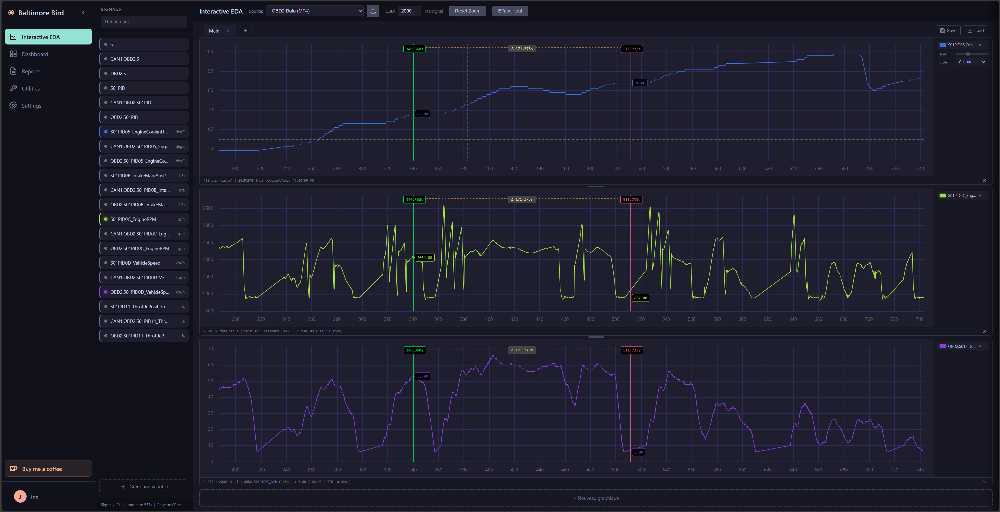

# Baltimore Bird

Web-based automotive data analysis platform for MF4/CAN bus data visualization and reporting.

[](https://app.codacy.com/gh/Vulriss/baltimorebird/dashboard?utm_source=gh&utm_medium=referral&utm_content=&utm_campaign=Badge_grade)
[](https://www.gnu.org/licenses/gpl-3.0)
[](https://www.python.org/downloads/)
[](https://vitejs.dev/)



**Live version:** [baltimorebird.cloud](https://baltimorebird.cloud)

## Project Goals

Baltimore Bird aims to provide engineers and analysts with a modern, accessible tool for exploring automotive time series data. The platform handles high-volume datasets with real-time visualization, removing the need for expensive proprietary software while maintaining professional-grade analysis capabilities.

Key objectives:
- Democratize access to automotive data analysis tools
- Deliver high-performance visualization without compromising on data fidelity
- Provide a secure, multi-tenant environment for teams to collaborate on vehicle data

## Features

- **Interactive EDA** — Drag-and-drop signal exploration with high-performance charting
- **Dashboard** — Visual block-based editor for building report templates
- **Reports** — View and export completed analysis results
- **Scripts** — Python script editor with secure sandbox execution
- **Conversion** — MF4 to CSV/Parquet, MF4 concatenation, calibration file converter
- **Multi-user** — Authentication and role management

## Documentation

- [User Guide](docs/user-guide.md)
- [API Reference](docs/API.md)
- [Deployment Guide](docs/deployment.md)

## Installation

### Backend setup
```bash
cd backend

# Virtual environment
python -m venv venv
source venv/bin/activate  # Linux/macOS
# or: venv\Scripts\activate  # Windows

# Dependencies
pip install -r requirements.txt

# Configuration
cp .env.example .env
nano .env  # Edit with your values

# Start server
python server.py
```

### Frontend setup
```bash
cd frontend

# Dependencies
npm install

# Dev
npm run dev
# → http://localhost:5173 (proxies API to :5000)

# Production build
npm run build
# → generates dist/
```

### Production configuration

Generate a secret key:
```bash
python -c "import secrets; print(secrets.token_hex(32))"
```

Edit `.env`:
```env
AUTH_SECRET_KEY=your-generated-secret-key
AUTH_TOKEN_EXPIRY_HOURS=168
FLASK_ENV=production
FLASK_DEBUG=0
```

## Development

Start both backend and frontend:

```bash
# Terminal 1 - Backend
cd backend
FLASK_DEBUG=1 python server.py
# → http://localhost:5000

# Terminal 2 - Frontend (Vite dev server)
cd frontend
npm run dev
# → http://localhost:5173
```

The Vite dev server proxies `/api` requests to the backend automatically.

## Deployment

### Build for production

```bash
cd frontend
npm run build
```

This generates an optimized `dist/` folder with:
- Bundled and minified JavaScript
- Optimized CSS
- Cache-busted asset filenames
- Copied `views/` and `components/` folders

### Nginx configuration

```nginx
server {
    listen 80;
    server_name your-domain.com;
    return 301 https://$host$request_uri;
}

server {
    listen 443 ssl http2;
    server_name your-domain.com;
    
    root /var/www/baltimorebird/frontend/dist;
    index index.html;
    
    # SSL
    ssl_certificate /etc/letsencrypt/live/your-domain.com/fullchain.pem;
    ssl_certificate_key /etc/letsencrypt/live/your-domain.com/privkey.pem;
    
    # Gzip
    gzip on;
    gzip_types text/plain text/css application/javascript application/json;
    
    # Upload size (MF4 files)
    client_max_body_size 1500M;
    
    # Vite assets (immutable)
    location /assets/ {
        expires 1y;
        add_header Cache-Control "public, immutable";
    }
    
    # Dynamic views (no cache)
    location /views/ {
        expires -1;
        add_header Cache-Control "no-cache";
    }
    
    # SPA fallback
    location / {
        try_files $uri $uri/ /index.html;
    }
    
    # API proxy
    location /api/ {
        proxy_pass http://127.0.0.1:5000;
        proxy_http_version 1.1;
        proxy_set_header Host $host;
        proxy_set_header X-Real-IP $remote_addr;
        proxy_set_header X-Forwarded-For $proxy_add_x_forwarded_for;
        proxy_set_header X-Forwarded-Proto $scheme;
        
        proxy_read_timeout 300s;
        proxy_request_buffering off;
    }
}
```

### Production stack

- **nginx** — Reverse proxy & static file serving
- **gunicorn** or **uwsgi** — WSGI server for Flask
- **Let's Encrypt** — SSL certificate

See [Deployment Guide](docs/deployment.md) for detailed instructions.

## Contributing

Contributions are welcome. Please read [CONTRIBUTING.md](CONTRIBUTING.md) for guidelines.
For bug reports or feature requests, please open an issue.

## License

This project is licensed under the GNU General Public License v3.0 - see the [LICENSE](LICENSE) file for details.

## Author

Geoffrey DOMERGUE