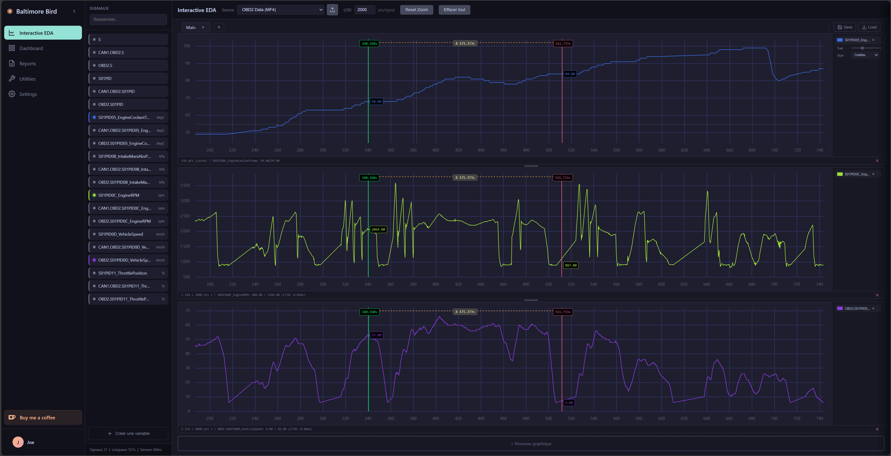

# Baltimore Bird

Web-based platform for exploring and reporting on automotive time series data (MF4 / CAN bus).

[](https://app.codacy.com/gh/Vulriss/baltimorebird/dashboard?utm_source=gh&utm_medium=referral&utm_content=&utm_campaign=Badge_grade)
[](https://www.gnu.org/licenses/gpl-3.0)
[](https://www.python.org/downloads/)
[](https://vitejs.dev/)



**Live version:** [baltimorebird.cloud](https://baltimorebird.cloud)

## Why this exists

Exploring CAN logs usually means expensive proprietary tooling, or a pile of one-off
Python scripts that nobody maintains. Baltimore Bird sits in between: drop an MF4 file
(with an optional DBC for decoding) in the browser, get every channel listed in
milliseconds, and plot millions of points interactively. Signals are loaded lazily and
downsampled server-side with LTTB (Numba-accelerated), so even multi-gigabyte
recordings with thousands of channels stay responsive.

## Features

- **Interactive EDA** - drag-and-drop signal exploration, synchronized cursors,
  boolean zone highlighting, categorical signal rendering
- **Dashboard** - block-based editor to build reusable report templates
- **Reports** - browse and export completed analyses
- **Scripts** - Python editor with sandboxed execution
- **Conversion** - MF4 to CSV, MF4 concatenation
- **Multi-user** - accounts, roles, per-user storage with quotas

## Getting started

You need Python 3.10+ and a JavaScript runtime. I use [bun](https://bun.com/) for the
frontend, but node/npm works the same way.

### Backend

```bash
cd src/backend

python -m venv venv
source venv/bin/activate        # Windows: venv\Scripts\activate
pip install -r requirements.txt

cp .env.example .env            # then fill in the values
python server.py                # http://localhost:5000
```

The server boots with two demo sources (a real OBD2 MF4 recording and a synthetic
dataset), so you can poke around before uploading anything.

### Frontend

```bash
cd src/frontend

bun install
bun run dev                     # http://localhost:5173, proxies /api to :5000
```

For a production bundle, `bun run build` generates `dist/` with hashed assets and the
`views/` and `components/` folders copied in.

### Smoke test

With the backend running, this exercises the whole critical path (auth, uploads,
lazy sessions, access control) in about a minute:

```bash
pip install -r tests/requirements-dev.txt
python tests/smoke_test.py
```

Run it before any deployment. It also accepts `--base-url` to target a remote server.

## Configuration

Everything lives in `src/backend/.env` (see `.env.example`). The two values that
matter in production:

```env
AUTH_SECRET_KEY=   # python -c "import secrets; print(secrets.token_hex(32))"
CORS_ORIGINS=https://your-domain.com
```

Without `AUTH_SECRET_KEY`, the server generates a temporary key at startup and tells
you so - fine for development, not for production.

## Deployment

The production stack is deliberately boring: nginx serves the Vite build and proxies
`/api/` to gunicorn, managed by systemd.

```ini
# /etc/systemd/system/baltimorebird.service
[Unit]
Description=Baltimore Bird API
After=network.target

[Service]
WorkingDirectory=/var/www/baltimorebird/src/backend
ExecStart=/var/www/baltimorebird/src/backend/venv/bin/gunicorn \
    -w 1 --threads 8 \
    --access-logfile - --error-logfile - \
    -b 127.0.0.1:5000 server:app
Restart=always

[Install]
WantedBy=multi-user.target
```

Keep a single worker: conversion tasks and EDA sessions live in process memory, so
multiple workers would not see each other's state. Threads handle the concurrency.
The access/error log flags route everything to journald (`journalctl -u baltimorebird -f`).

```nginx
server {
    listen 443 ssl http2;
    server_name your-domain.com;

    root /var/www/baltimorebird/src/frontend/dist;
    index index.html;

    ssl_certificate /etc/letsencrypt/live/your-domain.com/fullchain.pem;
    ssl_certificate_key /etc/letsencrypt/live/your-domain.com/privkey.pem;

    client_max_body_size 1500M;    # MF4 uploads

    location /assets/ {
        expires 1y;
        add_header Cache-Control "public, immutable";
    }

    location / {
        try_files $uri $uri/ /index.html;
    }

    location /api/ {
        proxy_pass http://127.0.0.1:5000;
        proxy_http_version 1.1;
        proxy_set_header Host $host;
        proxy_set_header X-Real-IP $remote_addr;
        proxy_set_header X-Forwarded-For $proxy_add_x_forwarded_for;
        proxy_set_header X-Forwarded-Proto $scheme;
        proxy_read_timeout 300s;
        proxy_request_buffering off;
    }
}
```

Deploying an update comes down to:

```bash
cd src/frontend && bun run build
sudo systemctl restart baltimorebird
sudo systemctl reload nginx
python tests/smoke_test.py --base-url https://your-domain.com
```

## Project notes

NA (for now)

## Contributing

Contributions are welcome - see [CONTRIBUTING.md](CONTRIBUTING.md), or open an issue
for bugs and feature requests.

## License

GNU General Public License v3.0 - see [LICENSE](LICENSE).

## Author

Geoffrey DOMERGUE